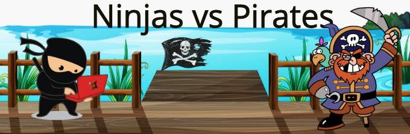

Use OOP to create console applications.

### Objectives:
* Use the starter code to make a RPG battle game between ninjas and pirates.
* Customize the attack methods on both the Ninja and Pirate class.
* Have an instance of a ninja and pirate battle it out until one's health is depleted.
* Use Inheritance, Class Methods, and Static Methods within your code.